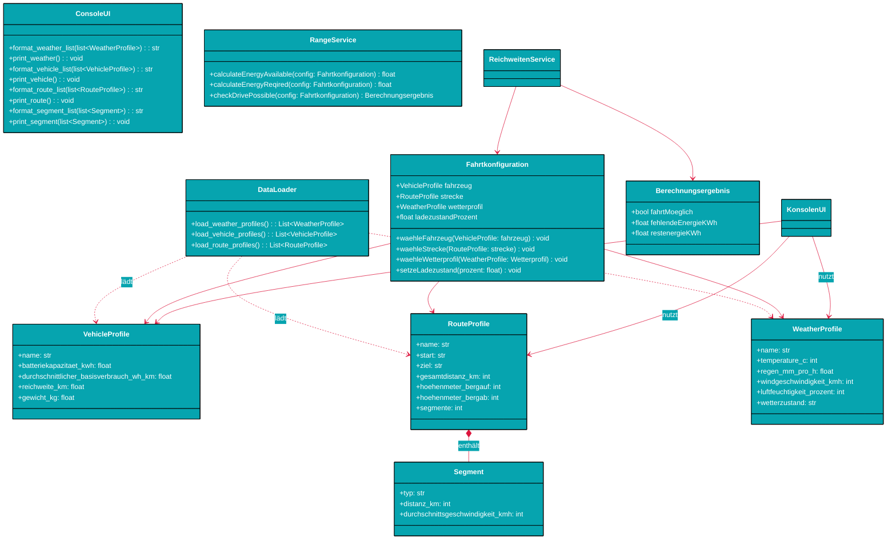

```mermaid

---
config:
  theme: 'base'
  themeVariables:
    primaryColor: '#06a4af'
    primaryTextColor: '#fff'
    primaryBorderColor: '#000000'
    lineColor: '#dc143c'
    secondaryColor: '#08858e'
    tertiaryColor: '#fff'
---

classDiagram

    class VehicleProfile {
        +name: str
        +batteriekapazitaet_kwh: float
        +durchschnittlicher_basisverbrauch_wh_km: float
        +reichweite_km: float
        +gewicht_kg: float        
    }

    class RouteProfile {
        +name: str
        +start: str
        +ziel: str
        +gesamtdistanz_km: int
        +hoehenmeter_bergauf: int
        +hoehenmeter_bergab: int
        +segmente: int
    }

    class Segment {
        +typ: str
        +distanz_km: int
        +durchschnittsgeschwindigkeit_kmh: int
    }

    class WeatherProfile {
        +name: str
        +temperature_c: int
        +regen_mm_pro_h: float
        +windgeschwindigkeit_kmh: int
        +luftfeuchtigkeit_prozent: int
        +wetterzustand: str
    }

    class DataLoader {
        +load_weather_profiles(): List~WeatherProfile~
        +load_vehicle_profiles(): List~VehicleProfile~
        +load_route_profiles(): List~RouteProfile~
    }

    class Fahrtkonfiguration {
        +VehicleProfile fahrzeug
        +RouteProfile strecke
        +WeatherProfile wetterprofil
        +float ladezustandProzent
        +waehleFahrzeug(VehicleProfile: fahrzeug) void
        +waehleStrecke(RouteProfile: strecke) void
        +waehleWetterprofil(WeatherProfile: Wetterprofil) void
        +setzeLadezustand(prozent: float) void
    }

    class ConsoleUI {
        +format_weather_list(list~WeatherProfile~): str
        +print_weather(): void
        +format_vehicle_list(list~VehicleProfile~): str
        +print_vehicle(): void
        +format_route_list(list~RouteProfile~): str
        +print_route(): void
        +format_segment_list(list~Segment~): str
        +print_segment(list~Segment~): void

    }

    class RangeService {
        +calculateEnergyAvailable(config: Fahrtkonfiguration) float
        +calculateEnergyReqired(config: Fahrtkonfiguration) float
        +checkDrivePossible(config: Fahrtkonfiguration) Berechnungsergebnis
    }

    class Berechnungsergebnis {
        +bool fahrtMoeglich
        +float fehlendeEnergieKWh
        +float restenergieKWh
    }

    RouteProfile "1" *-- "1...*" Segment : enthält
    
    DataLoader ..> VehicleProfile : lädt
    DataLoader ..> RouteProfile : lädt
    DataLoader ..> WeatherProfile : lädt
    Fahrtkonfiguration --> VehicleProfile
    Fahrtkonfiguration --> RouteProfile
    Fahrtkonfiguration --> WeatherProfile
    ReichweitenService --> Fahrtkonfiguration
    ReichweitenService --> Berechnungsergebnis
    KonsolenUI --> VehicleProfile : nutzt
    KonsolenUI --> RouteProfile : nutzt
    KonsolenUI --> WeatherProfile : nutzt

```