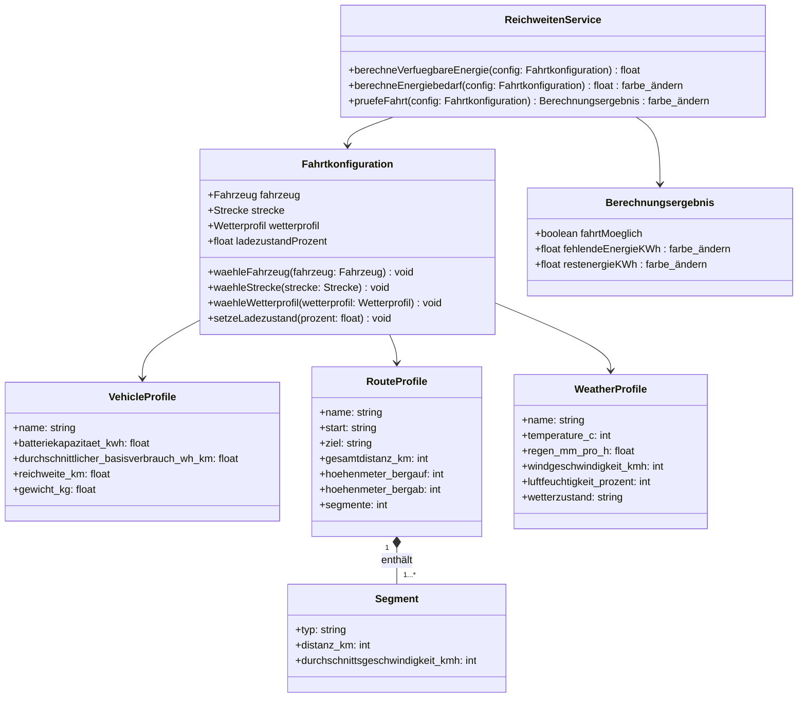

```mermaid
classDiagram

    class VehicleProfile {
        +name: string
        +batteriekapazitaet_kwh: float
        +durchschnittlicher_basisverbrauch_wh_km: float
        +reichweite_km: float
        +gewicht_kg: float        
    }

    class RouteProfile {
        +name: string
        +start: string
        +ziel: string
        +gesamtdistanz_km: int
        +hoehenmeter_bergauf: int
        +hoehenmeter_bergab: int
        +segmente: int
    }

    class Segment {
        +typ: string
        +distanz_km: int
        +durchschnittsgeschwindigkeit_kmh: int
    }

    class WeatherProfile {
        +name: string
        +temperature_c: int
        +regen_mm_pro_h: float
        +windgeschwindigkeit_kmh: int
        +luftfeuchtigkeit_prozent: int
        +wetterzustand: string
    }

    class Fahrtkonfiguration {
        +Fahrzeug fahrzeug
        +Strecke strecke
        +Wetterprofil wetterprofil
        +float ladezustandProzent
        +waehleFahrzeug(fahrzeug: Fahrzeug) void
        +waehleStrecke(strecke: Strecke) void
        +waehleWetterprofil(wetterprofil: Wetterprofil) void
        +setzeLadezustand(prozent: float) void
    }

    class ReichweitenService {
        +berechneVerfuegbareEnergie(config: Fahrtkonfiguration) float
        +berechneEnergiebedarf(config: Fahrtkonfiguration) float : farbe_ändern
        +pruefeFahrt(config: Fahrtkonfiguration) Berechnungsergebnis : farbe_ändern
    }

    class Berechnungsergebnis {
        +boolean fahrtMoeglich
        +float fehlendeEnergieKWh : farbe_ändern
        +float restenergieKWh : farbe_ändern
    }

    RouteProfile "1" *-- "1...*" Segment : enthält
    Fahrtkonfiguration --> VehicleProfile
    Fahrtkonfiguration --> RouteProfile
    Fahrtkonfiguration --> WeatherProfile
    ReichweitenService --> Fahrtkonfiguration
    ReichweitenService --> Berechnungsergebnis
```