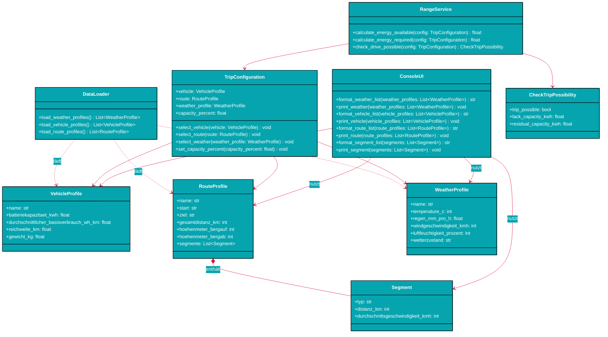

```mermaid

---
config:
  theme: 'base'
  themeVariables:
    primaryColor: '#06a4af'
    primaryTextColor: '#fff'
    primaryBorderColor: '#000000'
    lineColor: '#dc143c'
    secondaryColor: '#08858e'
    tertiaryColor: '#fff'
---

classDiagram

    class VehicleProfile {
        +name: str
        +batteriekapazitaet_kwh: float
        +durchschnittlicher_basisverbrauch_wh_km: float
        +reichweite_km: float
        +gewicht_kg: float        
    }

    class RouteProfile {
        +name: str
        +start: str
        +ziel: str
        +gesamtdistanz_km: int
        +hoehenmeter_bergauf: int
        +hoehenmeter_bergab: int
        +segmente: List~Segment~
    }

    class Segment {
        +typ: str
        +distanz_km: int
        +durchschnittsgeschwindigkeit_kmh: int
    }

    class WeatherProfile {
        +name: str
        +temperature_c: int
        +regen_mm_pro_h: float
        +windgeschwindigkeit_kmh: int
        +luftfeuchtigkeit_prozent: int
        +wetterzustand: str
    }

    class DataLoader {
        +load_weather_profiles() List~WeatherProfile~
        +load_vehicle_profiles() List~VehicleProfile~
        +load_route_profiles() List~RouteProfile~
    }

    class TripConfiguration {
        +vehicle: VehicleProfile
        +route: RouteProfile
        +weather_profile: WeatherProfile
        +capacity_percent: float
        +select_vehicle(vehicle: VehicleProfile) void
        +select_route(route: RouteProfile) void
        +select_weather(weather_profile: WeatherProfile) void
        +set_capacity_percent(capacity_percent: float) void
    }

    class ConsoleUI {
        +format_weather_list(weather_profiles: List~WeatherProfile~) str
        +print_weather(weather_profiles: List~WeatherProfile~) void
        +format_vehicle_list(vehicle_profiles: List~VehicleProfile~) str
        +print_vehicle(vehicle_profiles: List~VehicleProfile~) void
        +format_route_list(route_profiles: List~RouteProfile~) str
        +print_route(route_profiles: List~RouteProfile~) void
        +format_segment_list(segments: List~Segment~) str
        +print_segment(segments: List~Segment~) void
    }

    class RangeService {
        +calculate_energy_available(config: TripConfiguration) float
        +calculate_energy_required(config: TripConfiguration) float
        +check_drive_possible(config: TripConfiguration) CheckTripPossibility
    }

    class CheckTripPossibility {
        +trip_possible: bool
        +lack_capacity_kwh: float
        +residual_capacity_kwh: float
    }

    RouteProfile "1" *-- "1..*" Segment : enthält
    
    DataLoader ..> VehicleProfile : lädt
    DataLoader ..> RouteProfile : lädt
    DataLoader ..> WeatherProfile : lädt
    TripConfiguration --> VehicleProfile
    TripConfiguration --> RouteProfile
    TripConfiguration --> WeatherProfile
    RangeService --> TripConfiguration
    RangeService --> CheckTripPossibility
    ConsoleUI --> VehicleProfile : nutzt
    ConsoleUI --> RouteProfile : nutzt
    ConsoleUI --> WeatherProfile : nutzt
    ConsoleUI --> Segment : nutzt

```
